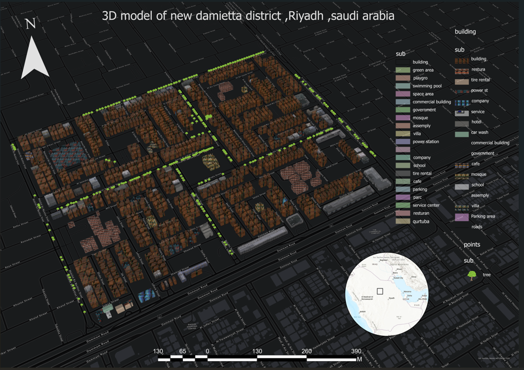

# 3D GIS Visualization of Al-Riyadh District – New Damietta

## 📌 Project Overview

This project presents a 3D GIS visualization of Al-Riyadh District in New Damietta using ArcGIS Pro.
The project aims to create an interactive 3D environment that supports urban planning, spatial analysis, and visualization. It includes building height visualization, road network analysis, and land-use representation.

## 🛠️ Tools & Technologies

- ArcGIS Pro
- 3D GIS
- Spatial Analysis
- Urban Planning
- GIS Visualization
- ModelBuilder
- ## 🎯 Key Features

- 3D visualization of buildings and urban features
- Building height analysis
- Road network visualization and analysis
- Land-use representation
- Interactive 3D map visualization
- Spatial analysis using GIS tools
- ## 🖼️ Project Preview

## 👩‍💻 Author

**Eman Ahmed Mohamed Sengar**

Geomatics Student | GIS & Remote Sensing Enthusiast
